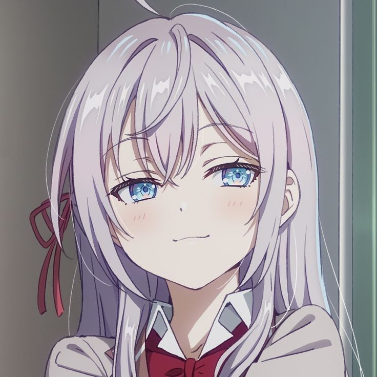
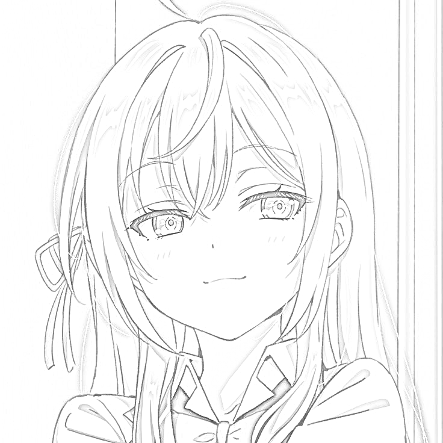

# ImagePencil - Convert Images to Pencil Sketches

ImagePencil is a Python project that transforms images into pencil sketches with an optional alpha channel (transparency). The project uses tools like OpenCV and scikit-learn for image processing and dominant color extraction.

## Features

- **Image to Pencil Sketch Conversion**: Converts an input image into a grayscale pencil sketch.
- **Dominant Color Extraction**: Utilizes KMeans clustering to identify the main colors in an image.
- **Transparency Support**: Generates a transparent version of the sketch based on the non-white regions of the original image.

## Prerequisites

Make sure you have Python 3 installed along with the following libraries:

- OpenCV: for image manipulation.
- NumPy: for array operations.
- Scikit-learn: for extracting dominant colors.

Install the required dependencies using pip:

```bash
pip install opencv-python-headless numpy scikit-learn
```

---

## Installation

### Clone the repository:
```bash
git clone https://github.com/ZAomineZ/sketch_ninja.git
cd sketch_ninja
```

---

## Usage

Run the script with the following command in a terminal:

```bash
python main.py <image_path>
```

## Arguments

- `<image_path>`: Path to the input image file.

### Example
```bash
python main.py test.jpeg
```

After execution, a pencil sketch image will be generated in the same directory as the source image with the suffix -drawing.png.

---

## Example Output

| **Original Image**     | **Pencil Sketch**           |
|------------------------|-----------------------------|
|  |  |